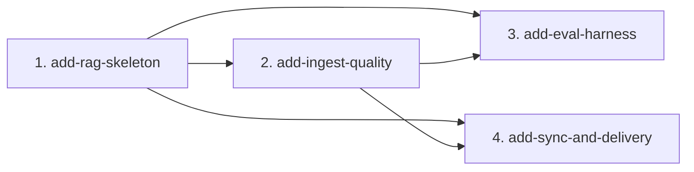

# MVP Capability Change Plan — askdocs

Splits the MVP (every `shipped` FR in [`requirements.md`](requirements.md)) into
capability slices the delivery loop executes one-by-one.

> **Reordered on purpose.** The PRD lists 7 sections in authoring order
> (ingest → retrieve → answer → cli → eval → docs & devex → sync). This plan
> collapses them into **4 dependency-ordered slices** and changes the order:
> build a thin end-to-end pipe first (so retrieve+answer are provable on day
> one), harden ingest next, lock quality with the eval harness, then add the
> moving part (sync) with delivery docs last.

## 1. Slicing principles

1. One slice = one cohesive, independently testable capability.
2. Dependency-respecting order; no slice depends on a later sibling.
3. One owner per MVP FR — every `shipped` FR assigned to exactly one slice.
4. `accepted` NFR/TC are cross-cutting — honored by every slice, owned by none.
5. Names: kebab-case `add-<capability>` under `openspec/changes/`.

## 2. The capability changes

| # | Change name | MVP FRs | Constraints in play | Depends on |
|---|---|---|---|---|
| 1 | `add-rag-skeleton` | FR-001, FR-003, FR-010, FR-020, FR-021, FR-030, FR-052 | TC-002, TC-003, TC-004, TC-005; NFR-001, NFR-002, NFR-004 | — |
| 2 | `add-ingest-quality` | FR-002, FR-004 | TC-006; NFR-003 | 1 |
| 3 | `add-eval-harness` | FR-040, FR-041, FR-042 | NFR-001, NFR-002, NFR-004 | 1, 2 |
| 4 | `add-sync-and-delivery` | FR-060, FR-050, FR-051 | TC-004; NFR-003 | 1, 2 |

**Cross-cutting NFRs every change MUST honor:** NFR-001 (answer without a
citation = bug), NFR-002 ("not in corpus" is valid), NFR-003 (done = green
pytest), NFR-004 (never answer from model general knowledge).

## 3. Dependency graph

**Critical path:** 1 → 2 → 3. Slice 4 depends only on 1 + 2, so it may run in
parallel with slice 3 (disjoint modules: `sync.py` + docs vs `eval.py` +
`golden.yaml`).

## 4. Per-change scope and exit criteria

### 4.1 `add-rag-skeleton` — the pipe end-to-end, in Docker

- **Scope in:** the three interfaces `DocSource` / `Retriever` / `LLMProvider`
  (TC-002) with ONE concrete impl each (TC-003: markdown DocSource,
  Qdrant Retriever, local OpenAI-compatible LLMProvider, sentence-transformers
  embeddings). Recursive `.md` ingest (FR-001). Write chunks + source metadata
  to Qdrant with **naive/simplest chunking for now** (FR-003). Retrieve relevant
  chunks (FR-010). Grounded, cited answer (FR-020) and honest "not in corpus"
  (FR-021). CLI question → answer + sources (FR-030). `docker compose up` with
  Qdrant as a separate service (FR-052, TC-004, TC-005).
- **Scope out:** structure-aware chunking (→ 4.2, FR-002), idempotency
  (→ 4.2, FR-004), eval (→ 4.3), continuous sync (→ 4.4, FR-060).
- **Definition of done:** `docker compose run cli "<q>"` returns a cited answer
  for an in-corpus question and an honest miss for an out-of-corpus one, over a
  ≥2-file corpus; happy-path pytest green in the container; no host Python used.
- **Risks:** interface shapes are ADR-worthy (they gate every later slice);
  chunking here is deliberately throwaway — don't over-build it.

### 4.2 `add-ingest-quality` — structure-aware chunking + idempotency

- **Scope in:** replace the throwaway chunker with structure-aware chunking that
  keeps tables/code/sections intact via markdown-it-py (FR-002). Idempotent
  re-index — re-ingesting identical files creates no duplicates (FR-004).
- **Scope out:** the store-write contract itself (owned by 4.1, FR-003).
- **Definition of done:** re-ingest of an unchanged corpus adds zero vectors;
  no structural block is split mid-table/mid-code; idempotency tests run against
  a clean/ephemeral Qdrant (TC-006) and are green.
- **Risks:** dedup key design (content hash vs path+section) — settle before build.

### 4.3 `add-eval-harness` — lock grounding & anti-hallucination

- **Scope in:** golden set of 20–30 Q/A over ГущоЛіт (FR-040). Retrieval metric:
  the correct chunk is found per question (FR-041). Anti-hallucination: every
  out-of-corpus question resolves to "не знаю" (FR-042). Enforces NFR-001/002/004
  as an executable gate.
- **Scope out:** the retrieval/answer implementation (owned by 4.1).
- **Definition of done:** `pytest` eval suite runs in the container and passes
  its retrieval + anti-hallucination thresholds; failures name the offending
  question. Meaningful only once 4.1 + 4.2 are green — hence its position.
- **Risks:** threshold calibration (how strict retrieval-hit must be).

### 4.4 `add-sync-and-delivery` — continuous sync + delivery docs

- **Scope in:** continuous directory sync — added/changed/deleted `.md` files
  auto-reindex (FR-060; this is the `askdocs.sync` compose default command).
  `README.md` (what/why/how-to-run, FR-050). `AGENTS.md` + `CLAUDE.md` for
  agents (FR-051).
- **Scope out:** realtime/background jobs beyond directory sync (FR-104, dropped).
- **Definition of done:** editing/adding/deleting a corpus file changes the next
  answer without a manual re-index; `docker compose up` self-populates and stays
  fresh; README + AGENTS/CLAUDE describe the run story accurately.
- **Risks:** delete-then-reindex race against in-flight queries.

## 5. FR coverage check

| FR | Slice | FR | Slice | FR | Slice |
|---|---|---|---|---|---|
| FR-001 | 1 | FR-021 | 1 | FR-042 | 3 |
| FR-002 | 2 | FR-030 | 1 | FR-050 | 4 |
| FR-003 | 1 | FR-040 | 3 | FR-051 | 4 |
| FR-004 | 2 | FR-041 | 3 | FR-052 | 1 |
| FR-010 | 1 | FR-020 | 1 | FR-060 | 4 |

Total: **15 MVP FRs across 4 slices** (no gaps, no duplicates).

## 6. Sequencing

Implement in dependency order 1 → 2 → (3 ∥ 4). After each slice archives, run
`npx openspec validate --all --strict` before starting the next. Future-Phase
work (FR-100..106, NFR-005) is NOT in this plan.
